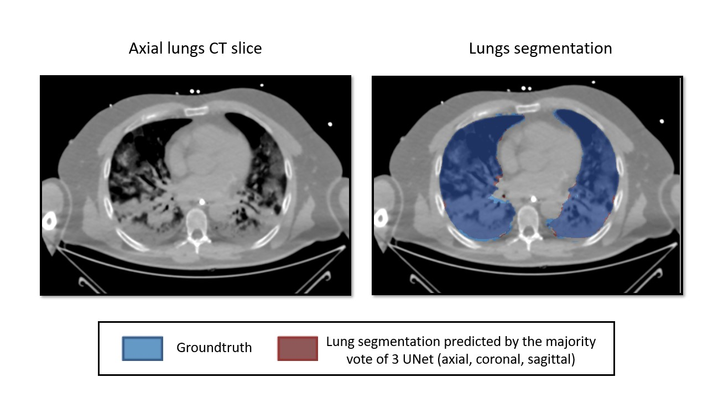

# deep_learning_lungs_segmentation

## Pre-requisites and installations

* Make sure you have python3 installed  

* Clone this repository on your machine and go in it:  

    `cd deep_learning_lungs_segmentation/`  

* Create a virtual environments  

    `python3 -m venv env_seg`  

* Activate the virtual environment  

    `source env_seg/bin/activate`  

* Update pip3 repository and install dependencies listed in the requirements.txt  

    `pip3 install --upgrade pip`  
    `python3 -m pip install -r requirements.txt`  

* Install Gatetools for preprocessing (optional)

    `pip3 install gatetools`  

## Use *our* trained model on *your* data

Preprocessing step : Your data spacing should be **1mm** isotropic  
You can use gatetools to do so, with the command :  

    Run : gatetools/bin/gt_affine_transform -i your_data.mhd -o preprocessed_data.mhd --newspacing "1.0" --force_resample --adaptive -p "-1000.0"

Then you need to make sure your data has the right size, meaning every dimension (x,y,z) should be divisible by 32. 

    Run : ./gt_image_resize -i preprocessed_data.mhd -o preprocesses_data_2.mhd --newsize  x,y,z -p "-1000.0" --interpolation_mode BSpline

You should change the path to your image at l.71 of the file _trained_model_on_your_data.py_ (params.input_img_path)

If your networks are located elsewhere than at _./data/model_weights/_, please put the right paths at lines 75, 76 and 77

Then to predict lungs mask with the model :

    Run : python3 trained_model_on_your_data.py
   Motion mask as .mhd and .raw files will be located in : `results_showcase/`  
  

## Acknowledments

Thanks to the authors of this repository : https://github.com/milesial/Pytorch-UNet for providing an efficient implementation of U-net.  

Thanks to Olivier Bernard for getting us started with the project by providing examples of his codes.
